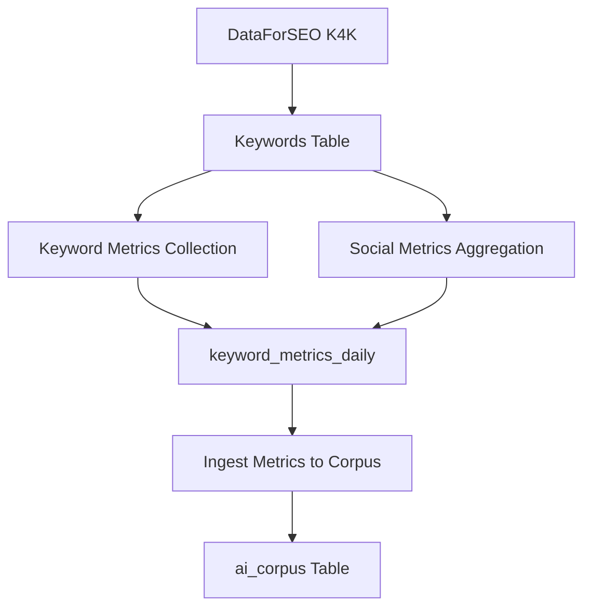

# Background Jobs Control Panel

## Overview

This document describes the Background Jobs Control Panel added to LexyHub's admin interface, which provides a centralized UI for monitoring and manually triggering all background automation jobs.

## Problem Statement

### DataForSEO and ai_corpus Population Issue

The `ai_corpus` table was not being populated despite DataForSEO jobs running successfully. Investigation revealed a multi-stage pipeline issue:

**The Pipeline:**
1. **DataForSEO Job** → Populates `keywords` table
2. **Metrics Collection Jobs** → Populate `keyword_metrics_daily` and `keyword_metrics_weekly` tables
3. **Corpus Ingestion Jobs** → Read from metrics tables and populate `ai_corpus` with embeddings

**The Issue:**
The metrics collection jobs (`ingest_metrics_and_score.ts` and `social-metrics-aggregator.ts`) existed only as CLI scripts without API route wrappers. This meant:
- They couldn't be triggered via HTTP endpoints
- They weren't included in the automated job workflows
- Even when DataForSEO ran successfully, the metrics tables remained empty
- Consequently, the corpus ingestion jobs had no data to ingest into `ai_corpus`

### Additional Challenges

- No centralized view of all background jobs
- No easy way to manually trigger jobs without using curl
- No visibility into job health and last run status
- Difficult to debug data pipeline issues

## Solution

### 1. Created Missing API Routes

Added HTTP endpoint wrappers for the CLI-only jobs:

**`/api/jobs/ingest-metrics`** (src/app/api/jobs/ingest-metrics/route.ts)
- Wraps `jobs/ingest_metrics_and_score.ts`
- Collects metrics for active keywords using AI inference
- Computes demand indices and trends
- Populates `keyword_metrics_daily` table

**`/api/jobs/social-metrics`** (src/app/api/jobs/social-metrics/route.ts)
- Wraps `jobs/social-metrics-aggregator.ts`
- Aggregates social signals from Reddit, Twitter, Pinterest, TikTok
- Combines data using platform-weighted scoring
- Populates `keyword_metrics_daily` with social data

### 2. Created Admin Control Panel APIs

**`/api/admin/jobs/status`** (src/app/api/admin/jobs/status/route.ts)
- Returns status of all configured background jobs
- Queries `job_runs` table for last execution data
- Calculates health status based on:
  - Success/failure of last run
  - Time since last successful run
  - Current run duration
- Status levels:
  - **Green (success)**: Last run succeeded within 48 hours
  - **Orange (warning)**: Running, or last success > 48 hours ago
  - **Red (error)**: Last run failed

**`/api/admin/jobs/trigger`** (src/app/api/admin/jobs/trigger/route.ts)
- Allows manual triggering of any job via HTTP POST
- Accepts job endpoint and optional parameters
- Uses service role authentication
- Returns job execution result

### 3. Created Admin Jobs Page

**Location:** `/admin/jobs` (src/app/(app)/admin/jobs/page.tsx)

**Features:**
- **Status Dashboard**: Shows counts of healthy, warning, and failed jobs
- **Job Listing**: Organized by category (Data Collection, Metrics, Analytics, AI, AI Corpus)
- **Status Indicators**: Visual badges with color-coded status (green/orange/red)
- **Manual Execution**: "Run" button for each job
- **Job Details**: Modal showing full job information including:
  - Endpoint and schedule
  - Last run time and duration
  - Last run status and metadata
- **Category Filtering**: Filter jobs by category
- **Auto-refresh**: Manual refresh button to update statuses

**Admin Access Control:**
- Already protected by existing `/admin` layout
- Uses `isAdminUser()` from `@/lib/auth/admin`
- Only accessible to users with admin privileges

### 4. Updated Navigation

Added "Background Jobs" section to admin navigation (src/components/admin/AdminNavigation.tsx)

## Job Definitions

The control panel tracks the following jobs:

| Job | Endpoint | Schedule | Category | Purpose |
|-----|----------|----------|----------|---------|
| DataForSEO K4K Ingestion | `/api/jobs/dataforseo/trigger` | Manual | Data Collection | Fetches keyword expansion data from DataForSEO |
| Keyword Metrics Collection | `/api/jobs/ingest-metrics` | Daily 02:00 UTC | Metrics | Collects and scores keyword metrics |
| Social Metrics Aggregation | `/api/jobs/social-metrics` | Every 6 hours | Metrics | Aggregates social platform signals |
| Trend Aggregation | `/api/jobs/trend-aggregation` | Every 6 hours | Analytics | Aggregates trend signals |
| Intent Classification | `/api/jobs/intent-classify` | Daily 03:00 UTC | Analytics | Classifies purchase intent |
| Rebuild Semantic Clusters | `/api/jobs/rebuild-clusters` | Daily 04:00 UTC | Analytics | Recomputes keyword clusters |
| Generate Embeddings | `/api/jobs/embed-missing` | Hourly | AI | Generates vector embeddings |
| Keyword Telemetry | `/api/jobs/keyword-telemetry` | Daily 00:30 UTC | Analytics | Collapses events to stats |
| Etsy Sync | `/api/jobs/etsy-sync` | Every 6 hours | Data Collection | Syncs Etsy marketplace data |
| Ingest Metrics to Corpus | `/api/jobs/ingest-corpus/metrics` | Daily 05:00 UTC | AI Corpus | Populates ai_corpus with metrics |
| Ingest Risks to Corpus | `/api/jobs/ingest-corpus/risks` | Daily 05:15 UTC | AI Corpus | Populates ai_corpus with risk data |
| Ingest Predictions to Corpus | `/api/jobs/ingest-corpus/predictions` | Daily 05:30 UTC | AI Corpus | Populates ai_corpus with predictions |
| Ingest All to Corpus | `/api/jobs/ingest-corpus/all` | Manual | AI Corpus | Runs all corpus ingestion jobs |

## Data Flow: DataForSEO to ai_corpus

### Correct Pipeline Order

To populate `ai_corpus` from DataForSEO data, run jobs in this sequence:



**Manual Execution Steps:**
1. Go to `/admin/jobs`
2. Run "DataForSEO K4K Ingestion" (if keywords need updating)
3. Run "Keyword Metrics Collection" (populates metrics from keywords)
4. Run "Social Metrics Aggregation" (adds social signals)
5. Run "Ingest Metrics to Corpus" (creates ai_corpus entries with embeddings)

**Or simply:**
1. Ensure keywords exist in the database
2. Run "Keyword Metrics Collection"
3. Run "Ingest All to Corpus"

## Usage

### Accessing the Control Panel

1. Navigate to `/admin/jobs` (must be logged in as admin)
2. View the status dashboard showing job health
3. Use category filter to focus on specific job types
4. Click "Refresh" to update job statuses

### Running a Job Manually

1. Find the job in the list
2. Click the "Run" button
3. Wait for confirmation toast
4. Click "Refresh" after a few seconds to see updated status

### Viewing Job Details

1. Click "Details" button for any job
2. View full job information including:
   - Description and schedule
   - Last run timestamp and duration
   - Last run status and metadata

### Debugging Failed Jobs

1. Check the status column for red (error) badges
2. Click "Details" to view last run metadata
3. Look for error messages in the metadata
4. Check job logs in the application logs
5. Verify required environment variables are set
6. Ensure database tables exist and have correct permissions

## Environment Variables Required

Jobs require these environment variables:

```bash
# Supabase (required for all jobs)
SUPABASE_URL=<your-supabase-url>
SUPABASE_SERVICE_ROLE_KEY=<your-service-role-key>

# DataForSEO (for DataForSEO job)
DATAFORSEO_LOGIN=<your-dataforseo-login>
DATAFORSEO_PASSWORD=<your-dataforseo-password>

# OpenAI (for metrics inference and embeddings)
OPENAI_API_KEY=<your-openai-api-key>

# Application (for job triggers)
NEXT_PUBLIC_BASE_URL=<your-app-url>
```

## Future Enhancements

Potential improvements:

- [ ] Add scheduled execution configuration UI
- [ ] Add job execution history view
- [ ] Add real-time job progress tracking
- [ ] Add job dependency visualization
- [ ] Add batch job execution
- [ ] Add job execution logs viewer
- [ ] Add Slack/email notifications for job failures
- [ ] Add job parameter configuration UI
- [ ] Add job execution metrics and analytics
- [ ] Add job retry mechanism
- [ ] Add job execution queue management

## Troubleshooting

### ai_corpus table is empty

**Check:**
1. Are keywords present in the `keywords` table?
2. Has "Keyword Metrics Collection" been run?
3. Does `keyword_metrics_daily` have data?
4. Has "Ingest Metrics to Corpus" been run?
5. Check job run status in the control panel

**Solution:**
Run jobs in correct order: DataForSEO → Metrics Collection → Corpus Ingestion

### Job shows as "unknown" status

**Cause:** Job has never been run, or `job_runs` table has no record

**Solution:** Run the job manually from the control panel

### Job shows as "warning" status

**Causes:**
- Last successful run was > 48 hours ago
- Job is currently running

**Solution:** If not currently running, trigger the job manually

### Job shows as "error" status

**Cause:** Last run failed

**Solution:**
1. Click "Details" to view error metadata
2. Check application logs for detailed error messages
3. Verify environment variables
4. Check database connectivity
5. Verify API credentials (DataForSEO, OpenAI, etc.)

## Files Changed

### New Files
- `src/app/api/jobs/ingest-metrics/route.ts` - Metrics collection API
- `src/app/api/jobs/social-metrics/route.ts` - Social metrics API
- `src/app/api/admin/jobs/status/route.ts` - Job status API
- `src/app/api/admin/jobs/trigger/route.ts` - Job trigger API
- `src/app/(app)/admin/jobs/page.tsx` - Admin jobs page
- `docs/JOBS_CONTROL_PANEL.md` - This documentation

### Modified Files
- `src/components/admin/AdminNavigation.tsx` - Added Jobs section

## Related Documentation

- [Background Jobs Operations Guide](./internal/background-jobs.md)
- [DataForSEO Setup Guide](./DATAFORSEO_SETUP_GUIDE.md)
- [LexyBrain RAG Audit](./internal/LEXYBRAIN_RAG_AUDIT_2025.md)
